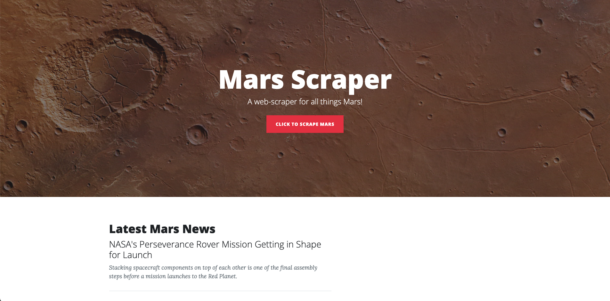

# Web Scraping Homework - Mission to Mars

In this assignment, I built a web application that scrapes various websites for data related to the Mission to Mars and displays the information in a single HTML page. See above for a screenshot of the initial homepage.

### This Application Consisted of 2 Steps

## Step 1 - Scraping

The scraping for this project used the following:
* Jupyter Notebook
* BeautifulSoup
* Pandas
* Requests/Splinter

### NASA Mars News

[Mars News Site](https://redplanetscience.com/)
* Collects the latest News Title and Paragraph Text

### JPL Mars Space Images - Featured Image

[Featured Space Image Site](https://spaceimages-mars.com)
* Uses splinter to navigate the site and find the image url for the current Featured Mars Image

### Mars Facts

[Visited the Mars Facts webpage](https://galaxyfacts-mars.com)
* Uses Pandas to scrape the table containing facts about the planet including Diameter, Mass, etc.
* Use Pandas to convert the data to a HTML table string.

### Mars Hemispheres

[here](https://marshemispheres.com/)
* Obtained high resolution images for each of Mar's hemispheres
* Uses a Python dictionary to store the data using the keys `img_url` and `title`

- - -

## Step 2 - MongoDB and Flask Application

Used MongoDB with Flask templating to create a new HTML page that displays all of the information that was scraped from the URLs above.

