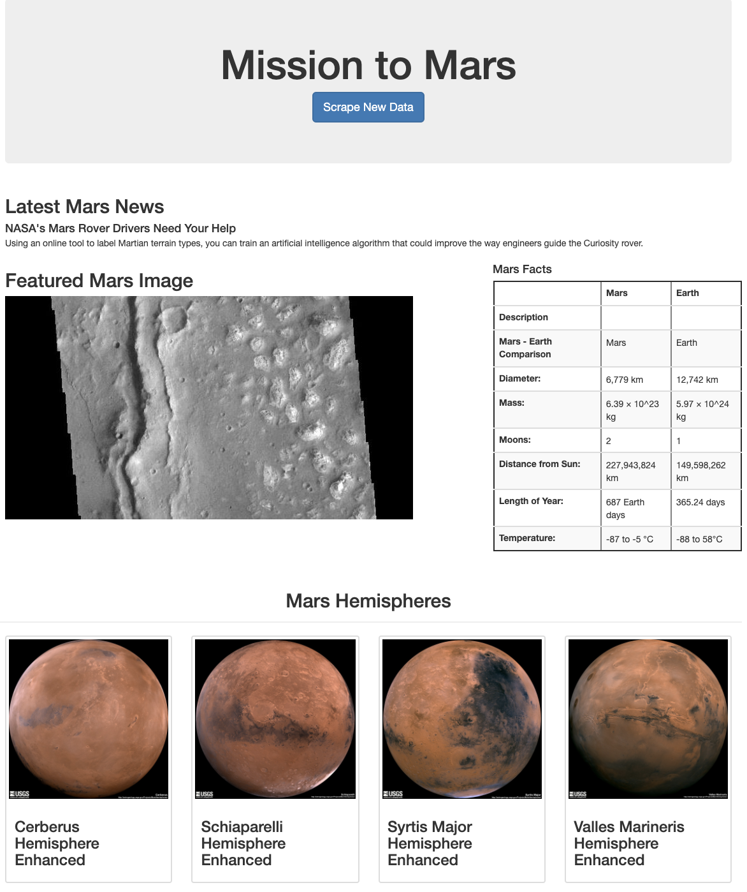

# Web Scraping Homework - Mission to Mars


In this assignment, I built a web application that scrapes various websites for data related to the Mission to Mars and displays the information in a single HTML page. See above for a screenshot of the initial homepage.

### This Application Consisted of 2 Steps


## Step 1 - Scraping

The scraping for this project used the following:
* Jupyter Notebook
* BeautifulSoup
* Pandas
* Requests/Splinter

### NASA Mars News

[Mars News Site](https://redplanetscience.com/)
* Collects the latest News Title and Paragraph Text

### JPL Mars Space Images - Featured Image

[Featured Space Image Site](https://spaceimages-mars.com)
* Used splinter to navigate the site and find the image url for the current Featured Mars Image

### Mars Facts

[Visited the Mars Facts webpage](https://galaxyfacts-mars.com)
* Used Pandas to scrape the table containing facts about the planet including Diameter, Mass, etc.

* Use Pandas to convert the data to a HTML table string.

### Mars Hemispheres

* Visit the astrogeology site [here](https://marshemispheres.com/) to obtain high resolution images for each of Mar's hemispheres.

* You will need to click each of the links to the hemispheres in order to find the image url to the full resolution image.

* Save both the image url string for the full resolution hemisphere image, and the Hemisphere title containing the hemisphere name. Use a Python dictionary to store the data using the keys `img_url` and `title`.

* Append the dictionary with the image url string and the hemisphere title to a list. This list will contain one dictionary for each hemisphere.

```python
# Example:
hemisphere_image_urls = [
    {"title": "Valles Marineris Hemisphere", "img_url": "..."},
    {"title": "Cerberus Hemisphere", "img_url": "..."},
    {"title": "Schiaparelli Hemisphere", "img_url": "..."},
    {"title": "Syrtis Major Hemisphere", "img_url": "..."},
]
```

- - -

## Step 2 - MongoDB and Flask Application

Use MongoDB with Flask templating to create a new HTML page that displays all of the information that was scraped from the URLs above.

* Start by converting your Jupyter notebook into a Python script called `scrape_mars.py` with a function called `scrape` that will execute all of your scraping code from above and return one Python dictionary containing all of the scraped data.

* Next, create a route called `/scrape` that will import your `scrape_mars.py` script and call your `scrape` function.

  * Store the return value in Mongo as a Python dictionary.

* Create a root route `/` that will query your Mongo database and pass the mars data into an HTML template to display the data.

* Create a template HTML file called `index.html` that will take the mars data dictionary and display all of the data in the appropriate HTML elements. Use the following as a guide for what the final product should look like, but feel free to create your own design.



- - -

## Step 3 - Submission

To submit your work to BootCampSpot, create a new GitHub repository and upload the following:

1. The Jupyter Notebook containing the scraping code used.

2. Screenshots of your final application.

3. Submit the link to your new repository to BootCampSpot.

4. Ensure your repository has regular commits and a thorough README.md file

## Hints

* Use Splinter to navigate the sites when needed and BeautifulSoup to help find and parse out the necessary data.

* Use Pymongo for CRUD applications for your database. For this homework, you can simply overwrite the existing document each time the `/scrape` url is visited and new data is obtained.

* Use Bootstrap to structure your HTML template.

## Rubric

[Unit 12 Rubric - Web Scraping Homework - Mission to Mars](https://docs.google.com/document/d/1paGEIFS5yp2VQu6G8F45B4uj1t1t29zL73KEQrD0xpo/edit?usp=sharing)

- - -

© 2021 Trilogy Education Services, LLC, a 2U, Inc. brand. Confidential and Proprietary. All Rights Reserved.
